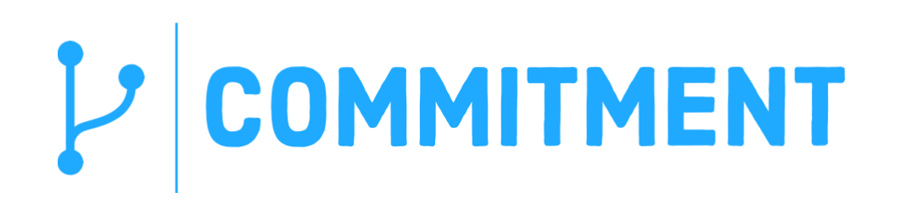

<div id="top"></div>

<!-- PROJECT LOGO -->
<div>
<p align="center">
   <a href="https://github.com/terminalPoltergeist/commitment">
      
   </a>
</p>
<div align="center">
  <span>Commitment is a graphical tool for viewing your git tree structure.</span>
  <br />
  <br />
  <!-- <a href="https://github.com/terminalPoltergeist/commitment"><strong>Explore the docs »</strong></a> -->
  <!-- <a href="https://github.com/terminalPoltergeist/commitment">View Demo</a> 
  · -->
  <a href="https://github.com/terminalPoltergeist/commitment/issues">Report Bug</a>
  ·
  <a href="https://github.com/terminalPoltergeist/commitment/issues">Request Feature</a>
  <br />
  <br />
  <a href="https://github.com/terminalPoltergeist/commitment/graphs/contributors">
     
  </a>
  &nbsp;
  <a href="https://github.com/terminalPoltergeist/commitment/network/members">
     
  </a>
  &nbsp;
  <a href="https://github.com/terminalPoltergeist/commitment/stargazers">
     
  </a>
  &nbsp;
  <a href="https://github.com/terminalPoltergeist/commitment/issues">
     
  </a>
  &nbsp;
  <a href="https://github.com/terminalPoltergeist/commitment/tags">
     
  </a>
  &nbsp;
  <a href="https://github.com/terminalPoltergeist/commitment/blob/main/LICENSE.txt">
     
  </a>
</div>
</div>

<!-- PROJECT SHIELDS
[![Contributors][contributors-shield]][contributors-url]
[![Forks][forks-shield]][forks-url]
[![Stargazers][stars-shield]][stars-url]
[![Issues][issues-shield]][issues-url]
[![Tags][tag-shield]][tag-url]
[![MIT License][license-shield]][license-url]
-->


<br/>

<!-- TABLE OF CONTENTS -->
<details>
  <summary>Table of Contents</summary>
  <ol>
    <li>
      <a href="#about-the-project">About The Project</a>
    </li>
    <!--
    <li>
      <a href="#getting-started">Getting Started</a>
      <ul>
        <li><a href="#installation">Installation</a></li>
      </ul>
    </li>
    <li><a href="#usage">Usage</a></li>
    -->
    <li><a href="#roadmap">Roadmap</a></li>
    <li>
      <a href="#contributing">Contributing</a>
      <ul>
        <li><a href="#how-to-contribute">How to Contribute</a>
      </ul>
    </li>
    <li><a href="#license">License</a></li>
    <li><a href="#contact">Contact</a></li>
  </ol>
</details>


<!-- ABOUT THE PROJECT -->
## About The Project
<p>Commitment is currently in prerelease 0.0.1<br/>Don't forget to star the repository to keep up with the release schedule!</p>
<p align="right">(<a href="#top">back to top</a>)</p>

<!-- GETTING STARTED -->
<!--
## Getting Started

This is an example of how you may give instructions on setting up your project locally.
To get a local copy up and running follow these simple example steps.

### Installation

1. Clone the repo
   ```sh
   git clone https://github.com/terminalPoltergeist/commitment.git
   ```
2. Install NPM packages
   ```sh
   npm install
   ```
3. Enter your API in `config.js`
   ```js
   const API_KEY = 'ENTER YOUR API';
   ```

<p align="right">(<a href="#top">back to top</a>)</p>
-->


<!-- USAGE EXAMPLES -->
<!--
## Usage

Use this space to show useful examples of how a project can be used. Additional screenshots, code examples and demos work well in this space. You may also link to more resources.

_For more examples, please refer to the [Documentation](https://example.com)_

<p align="right">(<a href="#top">back to top</a>)</p>
-->


<!-- ROADMAP -->
## Roadmap

- [ ] Add data-point objects
    - [ ] Compile data sources 
- [ ] Set up GUI
- [ ] Release 1.0.0!!

See the [open issues](https://github.com/terminalPoltergeist/commitment/issues) for a full list of proposed features (and known issues).

<p align="right">(<a href="#top">back to top</a>)</p>


<!-- CONTRIBUTING -->
## Contributing

Contributions are what make the open source community such an amazing place to learn, inspire, and create. Any contributions you make are **greatly appreciated**.

If you have a suggestion that would make this better, please fork the repo and create a pull request. You can also simply open an issue with the tag "feature".
Don't forget to give the project a star! Thanks again!

### How to Contribute

1. Fork the Project
2. Create your Feature Branch (`git checkout -b feature-AmazingFeature`)
3. Commit your Changes (`git commit -m 'Add some AmazingFeature'`)
4. Push to the Branch (`git push origin feature-AmazingFeature`)
5. Open a <a href="https://github.com/terminalPoltergeist/commitment/pulls">Pull Request</a>

<p align="right">(<a href="#top">back to top</a>)</p>


<!-- LICENSE -->
## License

Distributed under the MIT License. See `LICENSE.txt` for more information.

<p align="right">(<a href="#top">back to top</a>)</p>


<!-- CONTACT -->
## Contact

Jack Nemitz - [@nemitz_jack](https://twitter.com/nemitz_jack) - jack.nemitz@yahoo.com

Project Link: [https://github.com/terminalPoltergeist/commitment](https://github.com/terminalPoltergeist/commitment)

<p align="right">(<a href="#top">back to top</a>)</p>


<!-- MARKDOWN LINKS & IMAGES -->
<!-- https://www.markdownguide.org/basic-syntax/#reference-style-links -->
[contributors-shield]: https://img.shields.io/github/contributors/terminalPoltergeist/commitment.svg?style=flat-square&color=blue
[contributors-url]: https://github.com/terminalPoltergeist/commitment/graphs/contributors
[forks-shield]: https://img.shields.io/github/forks/terminalPoltergeist/commitment.svg?style=flat-square&color=blue
[forks-url]: https://github.com/terminalPoltergeist/commitment/network/members
[stars-shield]: https://img.shields.io/github/stars/terminalPoltergeist/commitment.svg?style=flat-square&color=blue
[stars-url]: https://github.com/terminalPoltergeist/commitment/stargazers
[issues-shield]: https://img.shields.io/github/issues/terminalPoltergeist/commitment.svg?style=flat-square&color=blue
[issues-url]: https://github.com/terminalPoltergeist/commitment/issues
[tag-shield]: https://img.shields.io/github/v/tag/terminalPoltergeist/commitment?label=version&style=flat-square&color=blue
[tag-url]: https://github.com/terminalPoltergeist/commitment/tags 
[license-shield]: https://img.shields.io/github/license/terminalPoltergeist/commitment.svg?style=flat-square&color=blue
[license-url]: https://github.com/terminalPoltergeist/commitment/blob/main/LICENSE.txt
<!-- [product-screenshot]: images/screenshot.png -->
